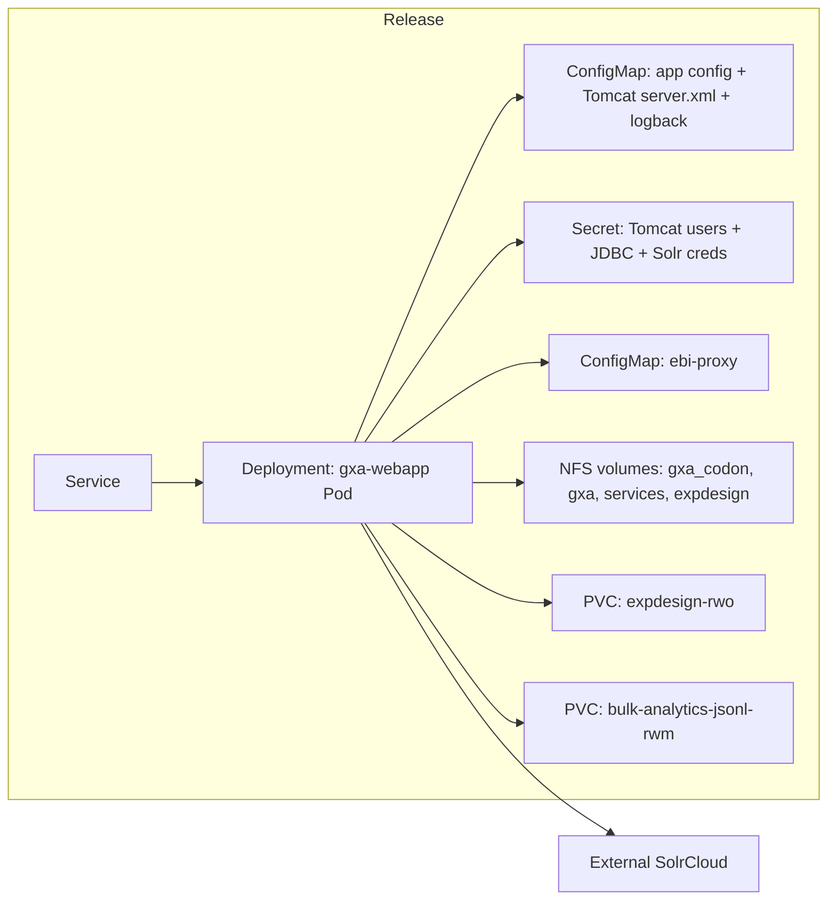

# GXA Helm Chart

This chart deploys the Gene Expression Atlas (GXA) web application on Kubernetes.
It provisions a Tomcat-based webapp Pod, mounts shared data from NFS and PVCs,
and wires in proxy settings and Solr credentials for upstream dependencies.

## High-level diagram

## What the chart includes

- **Deployment:** single Tomcat container (default image `tomcat:8-jdk11`) with optional JPDA debug port. See [templates/deployment.yaml](templates/deployment.yaml).
- **Service:** NodePort by default, exposing HTTP (and debug when enabled). See [templates/service.yaml](templates/service.yaml).
- **ConfigMaps:**
  - `{{ release }}-config` for `configuration.properties`, `server.xml`, `logback.xml`, and Solr settings. See [templates/configmap.yaml](templates/configmap.yaml).
  - `ebi-proxy` for HTTP/HTTPS proxy environment variables. See [templates/ebi-proxy.yaml](templates/ebi-proxy.yaml).
- **Secrets:**
  - `{{ release }}-secrets` for Tomcat users, JDBC config, and Solr credentials. See [templates/secret.yaml](templates/secret.yaml).
- **PVCs:** `expdesign-rwo` and `bulk-analytics-jsonl-rwm` (both kept by Helm). See [templates/expdesign-pvc.yaml](templates/expdesign-pvc.yaml) and [templates/bulk-analytics-pvc.yaml](templates/bulk-analytics-pvc.yaml).
- **Init containers:**
  - Snapshot experiments into an `emptyDir` via symlinks. See [templates/deployment.yaml](templates/deployment.yaml).
  - Seed the Tomcat manager app into an `emptyDir`. See [templates/deployment.yaml](templates/deployment.yaml).

## Volumes and mounts

- **NFS mounts (read-only where applicable):** `gxa_codon`, `gxa`, `services`, `expdesign`.
- **PVC mounts:** experiment design and bulk analytics JSONL data.
- **`emptyDir` mounts:** Tomcat logs, work, webapps, and `experiments-snapshot`.
- **Config/secret mounts:** webapp properties, Tomcat `server.xml`, and `tomcat-users.xml`.

## Proxy configuration

Proxy variables come from the `ebi-proxy` ConfigMap and are injected into the pod
as `HTTP_PROXY`, `HTTPS_PROXY`, `NO_PROXY`, and related variants. `CATALINA_OPTS`
is also populated to ensure Java-based proxy support.

## Images and repositories

- **Webapp:** `image.repository` + `image.tag` (defaults to `tomcat:8-jdk11`).
- **Init container:** `busybox` for the experiments snapshot setup.
- **Tomcat manager init:** uses the same `image.*` as the webapp.

## External dependencies

- **SolrCloud:** host and ZK endpoints are configured via `values.yaml` and injected
  into `configuration.properties` and secrets for authenticated access.

## Namespaces and environments

- The chart does not create a `Namespace` resource. Use Helm's `--create-namespace`
  (already used by `make deploy`) or create the namespace ahead of time.
- Each environment is expected to have its own values file named
  `values-<env>.yaml` under `charts/gxa/`.
- You can scaffold a new environment values file from the test template:
  `scripts/create-env.sh <env> [release]` (defaults to `gxa`).

## Configuration

### Webapp configuration

Key | Default | Description
--- | --- | ---
`image.repository` | `tomcat` | Webapp container image repository.
`image.tag` | `8-jdk11` | Webapp container image tag (defaults to chart appVersion when empty).
`nameOverride` | `""` | Overrides the chart name for resource naming.
`fullnameOverride` | `""` | Overrides the full resource name.
`serviceAccount.create` | `false` | Create a dedicated ServiceAccount.
`serviceAccount.annotations` | `{}` | Annotations for the ServiceAccount.
`serviceAccount.name` | `""` | ServiceAccount name override.
`podAnnotations` | `{}` | Extra annotations applied to the pod.
`podSecurityContext.runAsUser` | `2921` | Pod user ID for filesystem ownership.
`podSecurityContext.runAsGroup` | `1146` | Pod group ID for filesystem ownership.
`resources` | `{}` | Pod resource requests/limits.
`tomcat.httpPort` | `8080` | Tomcat HTTP port inside the container.
`tomcat.deployerPassword` | unset | Tomcat deployer password.
`tomcat.curatorPassword` | unset | Tomcat curator password.
`loggingLevel` | `DEBUG` | Application logging level.
`jdbc.populator.run` | unset | Enable JDBC populator job if defined.
`jdbc.url` | unset | JDBC URL for the GXA database.
`jdbc.password` | unset | JDBC password for the GXA database.
`solr.namespace` | unset | Namespace where SolrCloud is deployed.
`solr.user` | unset | Solr username.
`solr.password` | unset | Solr password.
`solr.collection` | unset | Default Solr collection name.
`solr.timeout` | unset | Solr client timeout (ms).
`nfs.server` | `hh-isi-srv-vlan1496.ebi.ac.uk` | NFS server hostname.

### Network access

Key | Default | Description
--- | --- | ---
`service.type` | `NodePort` | Service type for the webapp.
`service.port` | `80` | Service port for HTTP.
`ingress.enabled` | `true` | Create an Ingress resource.
`ingress.pathPrefix` | `/gxa` | Path prefix for regex routing and health bypass.
`ingress.cache.enabled` | `false` | Enable ingress-nginx `proxy-cache` annotations on the Ingress.
`ingress.cache.zoneName` | `gxa_cache` | `keys_zone` name (must match controller `http-snippet`).
`ingress.cache.valid200` | `60d` | TTL for cached 200 responses.
`ingress.cache.controllerCachePath` | `/tmp/gxa-nginx-cache` | Disk path in controller `proxy_cache_path` snippet.

**Ingress proxy cache** stores responses on the ingress-nginx controller, not in the GXA pod. Before enabling `ingress.cache.enabled`, merge `docs/ingress-nginx-values-gxa-cache.yaml` into the **ingress-nginx** Helm release (`ingress` namespace) — do not patch the ConfigMap by hand, or the next controller upgrade will revert it. Prefer `nginx.cache.enabled: false` when using ingress cache. Purge by clearing files under `controllerCachePath` on controller pods or restarting them.

### Debugging

Key | Default | Description
--- | --- | ---
`tomcat.debug.enabled` | `false` | Enable JPDA debug port.
`tomcat.debug.port` | `8000` | JPDA debug port.
`tomcat.debug.address` | `*:8000` | JPDA bind address.
